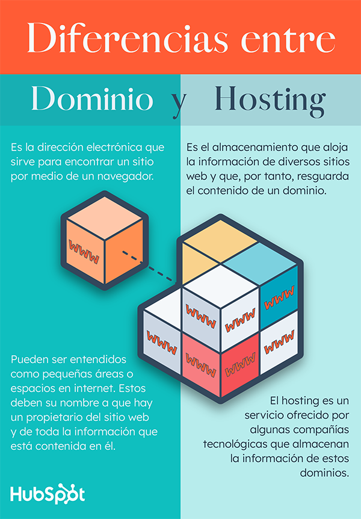

# Bienvenido a la Documentacion de facelad

****

## Diferencia entre hosting y dominio
Un dominio web es la dirección electrónica que sirve para encontrar tu sitio por medio de un navegador. Por otro lado, un hosting es el almacenamiento que aloja la información de diversos sitios web y que, por tanto, resguarda el contenido de un dominio.

### Los dominios pueden ser entendidos como pequeñas áreas o espacios en el internet.

Estos deben su nombre a que tú eres el propietario del sitio web y de toda la información que está contenida en él. Del mismo modo que en el mundo real, estos lugares pueden ubicarse mediante una dirección electrónica. Por ejemplo, la dirección general «www.facelad.com» sirve para localizar el dominio de Facelad y llegar a todas sus páginas.El hosting, por otro lado, es un servicio ofrecido por algunas compañías tecnológicas que almacenan la información de estos dominios. «Hosting» significa literalmente «alojamiento» en español."

### 3 funciones de un hosting y de un dominio

¿Alguna vez has alquilado una bodega? Si es así, sabes que al contratar los servicios de un negocio de almacenaje adquieres un espacio para guardar tus pertenencias, que se identifica con un número de bodega. Este número es el equivalente a la dirección electrónica de tu sitio web; el espacio dentro de tu bodega es semejante al dominio y la empresa que te ha rentado la bodega corresponde al servicio de hosting. Ahora que comprendes las diferencias de cada uno de estos elementos es momento de revisar sus funciones específicas.

****

## Conceptos Especificos

* [¿Que es un hosting?](hosting.md)
* [¿Que es un dominio?](domain.md)
